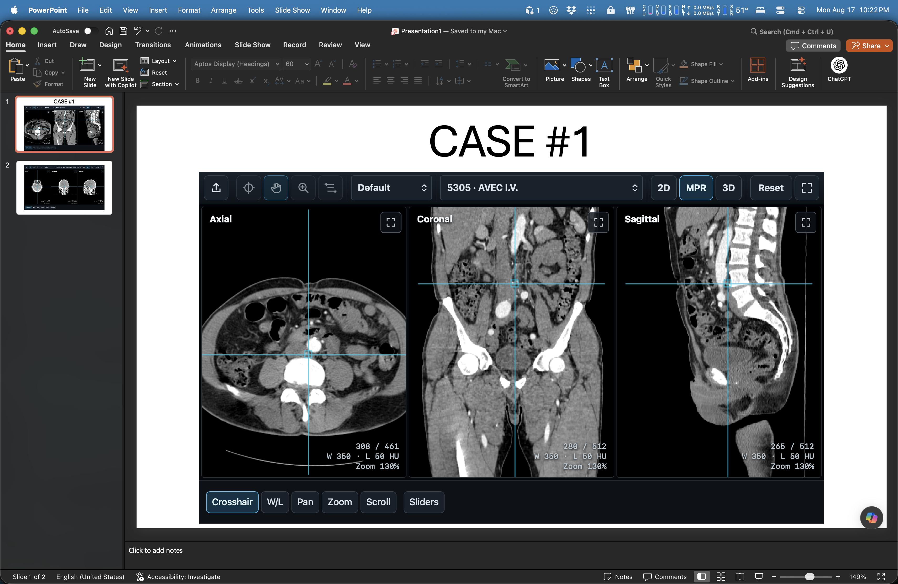
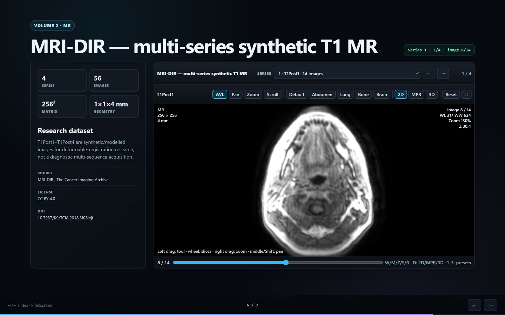
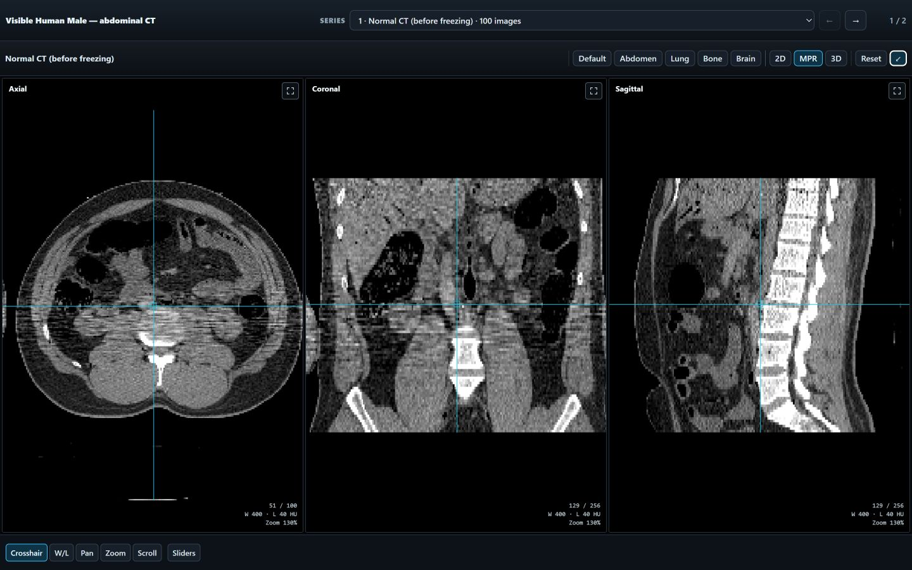
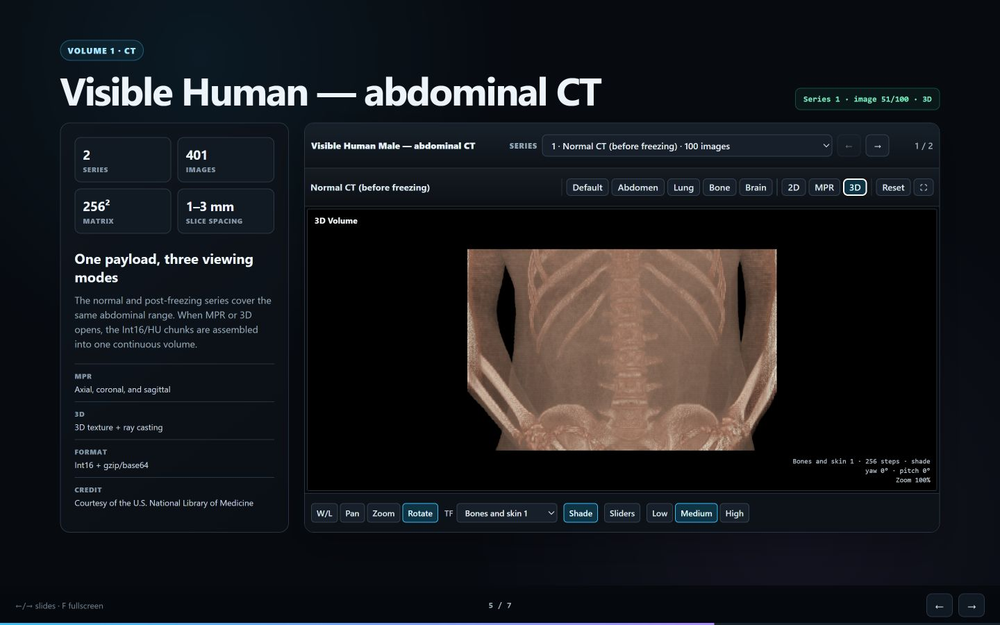
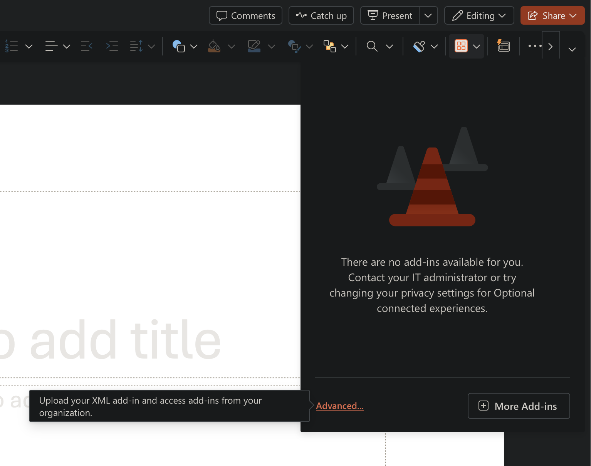
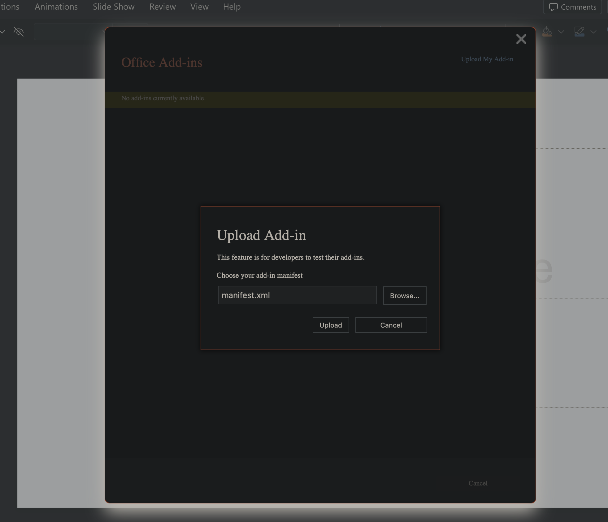

# DICOM Slide

Static medical viewer with a 2D stack, triplanar MPR, and WebGL2 ray-cast 3D
rendering. The same Int16 payload drives all three modes, with no NIfTI/Zarr
copy and no backend.

> **Demonstration, education, and research use only. Not intended for diagnosis or clinical decision-making.**

## Screenshots

**PowerPoint content add-in**



**Multi-series MR study in 2D**



**Full screen CT MPR**



**3D CT reconstruction**



## Install the PowerPoint add-in (quick installation)

The add-in itself is hosted on GitHub Pages. You only install its small XML
manifest; no DICOM files are uploaded during installation or import.

### Easiest on macOS or Windows: PowerPoint for the web

1. Right-click [Download the DICOM Slides manifest](https://github.com/ThalesMMS/dicom-slides/raw/refs/heads/main/powerpoint/manifest.xml), choose **Download Linked File As...** (or **Save link as...**), and save the file as `manifest.xml`.
2. Open [PowerPoint for the web](https://powerpoint.cloud.microsoft/) and open
   a presentation.
3. Choose **Home > Add-ins > More Settings** (shown as **Advanced** in some
   versions).

   <p> </p>

4. Choose **Upload My Add-in**, select the downloaded `manifest.xml`, and then
   insert **DICOM Slides**.
5. Open the add-in's gear menu and choose **Files**, **Folder**, or **ZIP** to
   import an exam locally.

The complete converted study is stored inside the presentation. Downloading or
copying the `.pptx` carries the interactive case to supported PowerPoint desktop
and web clients; IndexedDB is used only as a local performance cache.

If **Upload My Add-in** is missing, your Microsoft 365 organization may have
disabled custom add-ins. Ask its administrator or use a personal account that
allows sideloading.

### One-command helper for PowerPoint on macOS

Paste this command into Terminal. It downloads the readable installer first,
checks its published SHA-256, then installs or updates only the DICOM Slides
manifest. It does not require `sudo` and preserves other add-ins.

```console
installer="$(mktemp -t dicom-slides-install)" && curl --proto '=https' --tlsv1.2 -fsSLo "$installer" https://raw.githubusercontent.com/ThalesMMS/dicom-slides/main/scripts/install-powerpoint-macos.sh && printf '%s  %s\n' '5a881a92167e025c430021c735de4221274c93431e1abc9acb8faa0fc86c0319' "$installer" | shasum -a 256 -c - && bash "$installer"
```

To remove only DICOM Slides, download the same script and pass `--uninstall`:

```console
installer="$(mktemp -t dicom-slides-install)" && curl --proto '=https' --tlsv1.2 -fsSLo "$installer" https://raw.githubusercontent.com/ThalesMMS/dicom-slides/main/scripts/install-powerpoint-macos.sh && printf '%s  %s\n' '5a881a92167e025c430021c735de4221274c93431e1abc9acb8faa0fc86c0319' "$installer" | shasum -a 256 -c - && bash "$installer" --uninstall
```

### Manual installation for PowerPoint on macOS

1. Close PowerPoint.
2. Right-click [Download the DICOM Slides manifest](https://github.com/ThalesMMS/dicom-slides/raw/refs/heads/main/powerpoint/manifest.xml), choose **Download Linked File As...** (or **Save link as...**), and save the file as `manifest.xml`.
3. Open Terminal and run this command:

   ```console
   mkdir -p "$HOME/Library/Containers/com.microsoft.Powerpoint/Data/Documents/wef" && open "$HOME/Library/Containers/com.microsoft.Powerpoint/Data/Documents/wef"
   ```

   This creates the PowerPoint `wef` folder when it does not exist and opens it
   in Finder.
4. Move `manifest.xml` into the opened folder and rename it to
   `dicom-slides.xml`. If that file already exists, replace it to update DICOM
   Slides; leave every other XML file untouched.
5. Reopen PowerPoint and choose **Home > Add-ins > DICOM Slides**.

### One-command helper for Windows

Paste this command into PowerShell. It downloads the readable helper, validates
the manifest, saves it in Downloads, and opens PowerPoint for the web. Office
still requires you to complete the **Upload My Add-in** step yourself.

```powershell
$installer = Join-Path $env:TEMP ("dicom-slides-install-" + [guid]::NewGuid().ToString("N") + ".ps1"); $expected = "2292cdf066e961a48745db03affa80a2485271701bc745367b5da23b40c135a3"; Invoke-WebRequest "https://raw.githubusercontent.com/ThalesMMS/dicom-slides/main/scripts/install-powerpoint-windows.ps1" -OutFile $installer; if ((Get-FileHash -LiteralPath $installer -Algorithm SHA256).Hash.ToLowerInvariant() -ne $expected) { Remove-Item -LiteralPath $installer -Force; throw "DICOM Slides installer checksum mismatch" }; powershell.exe -NoProfile -ExecutionPolicy Bypass -File $installer
```

Windows desktop sideloading requires a trusted add-in catalog and may require
administrator approval. Run
`powershell.exe -NoProfile -ExecutionPolicy Bypass -File $installer -Mode DesktopGuide`
for the official desktop procedure. The execution-policy override applies only
to that child process and does not change the machine policy; an organization
can still block scripts. See the [complete PowerPoint installation and troubleshooting guide](powerpoint/README.md#installation).

## Local demo

Open `index.html` directly. The project and included studies work with
`file://`.

If your browser blocks local scripts, run:

```console
python serve.py
```

On Windows, you can also use `serve.bat`; on macOS/Linux, use
`./serve.command`. The runtime needs no `npm install`, CDN, application server,
or external JavaScript dependency.

## Included studies

| Study | Series | Images | Dimensions | Data license |
|---|---:|---:|---|---|
| Visible Human Male — abdominal CT | 2 (normal and after freezing) | 401 | 256 × 256 × 100/301 | Public domain + NLM terms |
| MRI-DIR — synthetic T1 MR | 4 (`T1Post1`–`T1Post4`) | 56 | 256 × 256 × 14 | CC BY 4.0 |

The CT is a reproducible derivative of the official NLM PNG images: abdominal
indices 1500–1800, 2× in-plane reduction, and conversion using
`HU = value − 1024`. The normal series has an acquisition gap at 1557. The MR
study is TCIA case `MRI-DIR-T1_1`; its four series are synthetic/modelled images
for deformable-registration research, not a multi-sequence clinical study.

Read [`DATA_LICENSES.md`](DATA_LICENSES.md) before redistributing images and
[`CITING.md`](CITING.md) before using them in a presentation. In particular:

- Visible Human: **“Courtesy of the U.S. National Library of Medicine”**. This
  attribution does not imply NLM endorsement.
- MRI-DIR: cite Ger et al. (2018), TCIA,
  [doi:10.7937/K9/TCIA.2018.3f08iejt](https://doi.org/10.7937/K9/TCIA.2018.3f08iejt),
  CC BY 4.0.

## Embed in another HTML presentation

Load the classic script and declare the Web Component:

```html
<div style="width:100%;height:70vh">
  <script src="../dicom-slide/runtime/dicom-slide.js"></script>
  <dicom-study-viewer
    study-id="mri-dir-t1-mr"
    src="../dicom-slide/exams/library/mri-dir-t1-mr/study.js"
    series="1">
  </dicom-study-viewer>
</div>
```

The component includes a series selector, 2D tools, presets, MPR, 3D,
expansion, and reset. Optional initial attributes are `series`, `mode`,
`preset`, `slice`, and `tool`. JavaScript integrations can await
`element.ready` and call `setSeries`, `setMode`, `setSlice`, `setPreset`,
`setWindow`, `setTool`, `setExpanded`, `reset`, or `getState`.

The complete contract is in [`runtime/README.md`](runtime/README.md). The
optional query-string/`postMessage` adapter is in `runtime/iframe/index.html`.

## Viewer controls

- `2D`: conventional axial stack.
- `MPR`: synchronized axial, coronal, and sagittal planes.
- `3D`: WebGL2 ray casting with transfer functions.
- `D`: switches 2D → MPR → 3D; `Esc`: returns to 2D.
- `W`, `M`, `Z`, `S`: Window/Level, Pan, Zoom, and Scroll.
- `R`: rotation in 3D.
- `1`–`5`: Default, Abdomen, Lung, Bone, and Brain presets.
- Mouse wheel: moves through slices in 2D/MPR and zooms in 3D.
- Right mouse button/`Alt` + drag: zoom; middle mouse button/`Shift` + drag:
  pan.

In 2D, only the needed chunk remains cached, with adjacent chunks prefetched.
On the first opening of MPR or 3D, chunks for the active series are lazily
assembled into a continuous volume. The CPU safety limit is 512 MiB; the GPU
payload is reduced when necessary to respect the 3D texture limit.

## Data format

```text
dicom-slide-study/1
  study.js
  study.json
  series/<id>/
    manifest.js
    manifest.json
    chunks/
      chunk-000.js  # Int16 little-endian → gzip → base64 → local script
```

Scripts register data without `fetch`, so they work with `file://`. LPS
geometry, spacing, slice coordinates, windowing, presets, and provenance stay
in the manifests.

## Process a new DICOM study

Put the raw directory or ZIP in `exams/inbox/` (ignored by Git) and generate a
static package:

```console
python tools/convert_study.py exams/inbox/my-exam.zip exams/library/my-exam \
  --study-id my-exam \
  --title "My study" \
  --chunk-size 12
```

The converter accepts monochrome/RGB single-frame images, Implicit/Explicit VR
Little Endian, and Explicit VR Big Endian. Pillow can decode JPEG 2000
single-frame images; other compressed syntaxes require `gdcmconv` only in the
conversion environment. The PowerPoint browser importer ships a local
OpenJPEG/Wasm decoder for single-frame JPEG 2000; it does not upload pixels to a
service.

Optional conversion dependencies:

```console
python -m pip install -r requirements-conversion.txt
```

## Rebuild the Visible Human study

The importer downloads both official series, validates the PNGs, records
hashes, and only then publishes the package atomically:

```console
python tools/import_visible_human.py exams/library/visible-human-abdomen-ct \
  --start 1500 --end 1800 --downsample 2 --chunk-size 12 \
  --cache-dir /path/to/cache
```

## Validation

```console
python tools/validate_project.py exams/library/visible-human-abdomen-ct
python tools/validate_project.py exams/library/mri-dir-t1-mr
python -m unittest discover -s tests/python -v
node tests/javascript/test_volume_integration.js
```

The validator checks manifests, series, counts, scripts, base64, gzip, and the
exact size of decompressed buffers.

## Repository layout

```text
index.html
runtime/                 reusable viewer
presentation/            modular deck
exams/
  inbox/                 raw sources ignored by Git
  library/               two demonstration packages
tools/                    converters, importer, and validator
scripts/                  PowerPoint installation helpers
tests/                    Python, JavaScript, and browser tests
LICENSE                   code/documentation: MIT
DATA_LICENSES.md          image licenses and provenance
CITATION.cff              GitHub citation metadata
CITING.md                 ready-to-use presentation wording
```

## Slide authoring

Each slide is an independent document in
`presentation/slides/<number-name>/index.html`. The order is in
`presentation/slides.js`; see [`presentation/README.md`](presentation/README.md).

To build a presentation from your own cases, give a file-capable local AI agent this repository URL and the path to an anonymized DICOM directory or ZIP. Keep raw inputs in `exams/inbox/` or another ignored local directory. The converter does not certify anonymization; inspect all metadata before publishing.

## Licenses

The code and original documentation are distributed under the MIT license.
Image data retain their own terms: Visible Human/NLM and MRI-DIR/TCIA CC BY 4.0.
See [`DATA_LICENSES.md`](DATA_LICENSES.md); applicable texts are in
[`LICENSES/`](LICENSES/).
